# 如何构建核心循环

---

## 初步概念

玩家每一局都是为了获取得分，得分可以在局内消耗用于撤回操作，购买物品，也可以在对局结束后解锁新东西。

得分：用于撤步/解锁模式

    C：碰撞    D：摧毁  S：剪刀

单位：
1. 灌木-D树枝
2. 碎石-D石头
3. 小树-C树枝-S树叶-D原木
4. 大树-C树枝2-S树叶2-D原木，变成树桩/特殊的树桩
5. 树桩-D原木
6. 巨石-D石头，变成碎石/矿石/水晶
7. 苔石-S青苔，变成巨石-D石头，变成碎石/矿石/水晶
8. 生气的巨石？
9. 矿石-D铁矿
10. 大矿石-D铁矿，变成矿石
11. 水晶-D水晶/？，变成？
12. 宝箱-C，喷出宝物-D？
15. 黑石-无法摧毁

生物：
1. 商人-C交易
2.  流浪商人？

地形：

14. 通道-只能在一个方向往返
15. 冰面-多移动一步
16. 传送带-即刻移动玩家
17. 墙-阻挡

结构：承担了某种设计，用于引导玩家
1. 

资源：
1. 树枝
2. 石头
3. 原木
4. S青苔
5. S树叶

自动合成，合成时优先选择

1. 空手可撸树、石头等大部分资源
2. 树枝+树枝=木棍
3. 树枝+石头=斧
4. 木棍+石头=镐
5. 铁+铁=剪刀
6. 斧/镐+铁=铁斧/镐
7. 斧/镐+水晶=水晶斧/镐
8. 